[](https://urban-attiva.herokuapp.com/)

# Urban Attiva Website


This website has been developed as the first iteration of an eCommerce store for Urban Attiva, a sports equipment retailer. The website provides shoppers with the ability to browse and securely purchase products, add product reviews and to read the company blog to find out what is new with Urban Attiva and to leave comments on blog articles.

The site was developed using knowledge gained from the Code Institute HTML Essentials, CSS Essentials, User Centric Frontend Development, Interactive Frontend Development, Backend Development and Full Stack Frameworks modules.

View the live website [here.](https://urban-attiva.herokuapp.com/)

---

## Contents

1.  [User Experience Design](#user-experience-design)
2.  [Features](#features)
3.  [Technologies Used](#technologies-used)
4.  [Testing](#testing)
5.  [Deployment](#deployment)
6.  [Credits](#credits)

---

## User Experience Design

### Strategy

The key business goals for developing the website are:

-   To sell both own brand and established brand sports products to generate revenue for the company.
-   To promote the Urban Attiva brand through the website, blog, and social media to establish brand recognition, reputation, and loyalty.

The key user goals for the website are:

-   To find and purchase quality products that will help me with my training and competition in my chosen sport.
-   To be kept informed of news and information in relation to the Urban Attiva company.

### Scope

#### User Stories

The requirements for the Urban Attiva website are captured as user stories.

#### Website Owner

-   As the website owner, I want to ensure the branding is clear and consistent across the website so that the user has a consistent experience.
-   As the website owner, I want to ensure the website is search engine optimised so that users can easily find our website.
-   As the website owner, I want to ensure the website is accessible to all users so that all users can use our website.
-   As the website owner, I want to ensure the website is conformant to web development best practices so that I know the development quality meets required standards.
-   As the website owner, I want to ensure the website is compatible with different browsers so that users have a consistent experience no matter which browser they use.
-   As the website owner, I want to ensure the website is secure so that only authorised users can access store management functionality.

#### Shoppers

-   As a shopper, I want to understand what the store sells and to be able to navigate the website easily so that I can so that I can decide if I want to purchase any products.
-   As a shopper, I want to be able to access the website on all types of device so that I can use the device that is most convenient to me at the time.
-   As a shopper, I want to search products by name or description so that I can find specific products that I'd like to purchase.
-   As a shopper, I want to see products matching what I have searched for and the number of results returned so that I can see whether the product I searched for is available.
-   As a shopper, I want to view and sort multiple categories of products simultaneously so that I can find the products by price, name, rating, or category across parent categories e.g. 'nutrition' or 'cycling'.
-   As a shopper, I want to view and sort specific categories of product so that I can find products by specific category e.g. 'running shoes' and sort by price, name, or rating.
-   As a shopper, I want to view and sort the full list of available products so that I can find products by price, name, rating, or category from the full list of products.
-   As a shopper, I want to view individual product details so that I can see the price, description, product rating, product image and available sizes of products.
-   As a shopper, I want to be able to select the quantity and size of product so that I can purchase the product quantity I want and in the correct size.
-   As a shopper, I want to view products that have been added to my shopping bag so that I can see the items I have selected and the total cost of the items in my shopping cart.
-   As a shopper, I want to adjust the quantity of items in my shopping bag so that I can make changes to the contents of my shopping cart before checkout.
-   As a shopper, I want to purchase an item without registering so that I can quickly purchase items without the need to register.
-   As a shopper, I want to enter my payment information so that I can quickly check out and pay for my items.
-   As a shopper, I want to view an order confirmation after checkout so that I can verify that I haven't made any mistakes when entering my information.
-   As a shopper, I want to receive an order confirmation after checkout so that I can keep a proof of purchase.
-   As a shopper, I want to read item reviews from registered shoppers so that I can see how other shoppers rate the products.
-   As a shopper, I want to see updates in relation to the company or interesting material so that I can find out more about the company, related topics, or events.
-   As a shopper, I want to search blog posts so that I can find blog posts of interest to me.
-   As a shopper, I want to register for an account so that I can have a personal account and be able to view my profile.

#### Registered Users

-   As a registered user, I want to receive a confirmation email after registering so that I can verify that my account was successfully registered.
-   As a registered user, I want to have a personal user profile so that I can view my account information, order history and order confirmations.
-   As a registered user, I want to log in and log out once I have registered so that I can access my personal account information.
-   As a registered user, I want to add a product review so that I can provide a review of the product that I have purchased.
-   As a registered user, I want to recover my password if I have forgotten it so that I can gain access to my account.
-   As a registered user, I want to leave comments on blog posts so that I can express my views on the blog content.

#### Administrator

-   As an administrator, I want to add a blog post so that I can publish blog posts for users to read.
-   As an administrator, I want to add a product so that I can add new items to the store.
-   As an administrator, I want to delete a product so that I can remove items that are no longer sold.
-   As an administrator, I want to delete reviews so that I can remove inappropriate reviews.
-   As an administrator, I want to edit / update a blog post so that I can amend the content of blog posts.
-   As an administrator, I want to edit / update a product so that I can change product prices, descriptions, images, and other product attributes.
-   As an administrator, I want to delete blog posts so that I can remove old blog entries.
-   As an administrator, I want to delete blog post comments so that I can remove inappropriate comments.

### Structure

The Urban Attiva website has been designed to provide be intuitive and easy to navigate. The site has been developed to enable visitors to register, log in, search for products to add to their shopping cart, to check out securely, and to access their account information.

The website has the following key elements:

-   A simple landing page design with a main navigation menu with links for the home page, shop, blog, and user account. 
-   The home page has a hero image with header and a prominent shop now button, images with links to the product categories, and a footer with links to further information and social media. A dropdown search field allows users to search for  products by entering their own search criteria.
-   The shop dropdown menu provides access to the main product categories and the product pages enable sorting within categories with a link through to individual product details.
-   Shopping cart and checkout functionality.
-   A blog page listing recent blog posts.
-   An account dropdown menu with links to register and log in. Once logged in a user has access to their profile and administration users can access the product and blog management functionality.

#### Information Architecture

The Urban Attiva database has nine tables as detailed in the attached data model diagram below.

Data Model:

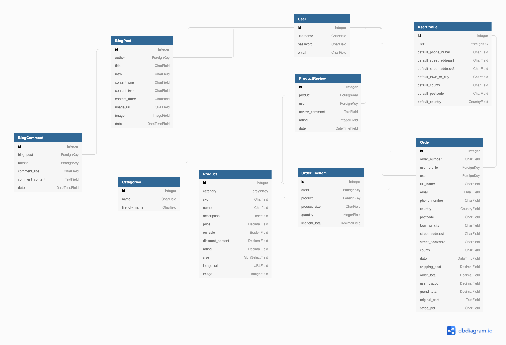

### Skeleton

#### Wireframes

The wireframes were developed using [Balsamiq](https://balsamiq.com/).

-   Small device [wireframes](readme-files/urban-attiva-small-device.png).
-   Large device [wireframes](readme-files/urban-attiva-large-device.png).

The following changes were made after the initial design.

-   Functionality to enable users to leave product reviews.
-   Registered user discount functionality.


### Surface

The Urban Attiva website features a clean and simple design with #4B5657 used for dark backgrounds and text and #F6F7F7 for light backgrounds and text to provide a good contrast.

#### Branding

A simple Urban Attiva logo has been developed aligned to the branding for an existing sister company.


#### Colours

Full details of the Urban Attiva colour template can be found in the [Urban Attiva Branding Guidelines](readme-files/urban-attiva-branding-guidelines.pdf)

The footer section is #DEE3E3 and is on the same monochromatic scale as #4B5657 as used for the dark text and dark backgrounds. 

The product and blog listing cards are #FFFFFF so that they pop from the page against the #F6F7F7 background. The product detail page utilises #FFFFFF for the background to match the image background.

#### Typography

Roboto font has been utilised for all text across the website and detailed in the [Urban Attiva Branding Guidelines](readme-files/urban-attiva-branding-guidelines.pdf). This is a simple and modern font available from the Google Fonts library which is unobtrusive and easy to read. Font Awesome icons have been utilised for icons throughout the site.

#### Images

Images are used to add some additional colour to the website home page and for the product cards and blog posts.

### Defensive Design

The website has been developed incorporating the following defensive design aspects.

#### Error Handling

-   Toast have been utilised to provide users with messages clearly stating that an error has occurred
-   Error pages for 404 and 500 errors which will be displayed to the user if either of these errors occur with a link back to the home page.

#### Confirm on Delete

-   All areas of the website where users can delete data incorporate modals to prompt the user if they really want to permanently delete the data.

#### User Authentication and Privileges

-   Non-registered (anonymous) users can browse the website, purchase products, read the blog and see customer reviews and blog comments.
-   Registered users can view and update their account profile and view their order history as well as being able to add product reviews and blog comments.
-   Administrators (super users) can access and utilise the product management and blog management functionality and delete inappropriate customer reviews or blog comments. 

#### Data Input Validation

Django-allauth is utilised for all authentication, registration, and account management functionality. This functionality incorporates data validation on these forms.

Data validation on custom forms is incorporated on all data input fields with the following validation applied to:

Product management form:

-   SKU - optional field restricted to 7 characters.
-   Name - users are prevented from adding just blank spaces and an error message toast informs the user that they should not enter just blank spaces in the product name or description fields. A regex pattern has been applied to the comments field to restrict the users to entering only text, numbers, and common punctuation characters.
-   Description - users are prevented from adding just blank spaces and an error message toast informs the user that they should not enter just blank spaces in the product name or description fields. A regex pattern has been applied to the comments field to restrict the users to entering only text, numbers, and common punctuation characters.
-   Price - required field with a maximum of 4 digits
-   Discount % - this field is required when the on_sale flag is selected. Users are prevented from submitting the product form until a discount percentage has been added and an error is displayed below the field stating the discount percentage must be added for a product that is on sale.
-   Image URL - django model URLField to ensure only a valid URL is added.

Blog management form:

-   Title - users are prevented from adding just blank spaces and an error message informs the user that valid text is required and the field must not be blank. A regex pattern has been applied to the comments field to restrict the users to entering only text, numbers, and common punctuation characters.
-   Intro - users are prevented from adding just blank spaces and an error message informs the user that valid text is required and the field must not be blank. A regex pattern has been applied to the comments field to restrict the users to entering only text, numbers, and common punctuation characters.
-   Content one - users are prevented from adding just blank spaces and an error message informs the user that valid text is required and the field must not be blank. A regex pattern has been applied to the comments field to restrict the users to entering only text, numbers, and common punctuation characters.
-   Content two - users are prevented from adding just blank spaces and an error message toast informs the user that they should not enter just blank spaces in the product name or description fields. A regex pattern has been applied to the comments field to restrict the users to entering only text, numbers, and common punctuation characters.
-   Content three - users are prevented from adding just blank spaces and an error message toast informs the user that they should not enter just blank spaces in the product name or description fields. A regex pattern has been applied to the comments field to restrict the users to entering only text, numbers, and common punctuation characters.
-   Image URL - django model URLField to ensure only a valid URL is added.

Product review form:

-   Rating - required field with dropdown select option
-   Review comment - users are prevented from adding just blank spaces and an error message toast informs the user that they should not enter just blank spaces in the review form. A regex pattern has been applied to the comments field to restrict the users to entering only text, numbers and common punctuation characters.

Blog comment form:

-   Comment title - users are prevented from adding just blank spaces and an error message toast informs the user that they should not enter just blank spaces in the comment form. A regex pattern has been applied to the comments field to restrict the users to entering only text, numbers, and common punctuation characters.
-   Comment - users are prevented from adding just blank spaces and an error message toast informs the user that they should not enter just blank spaces in the comment form. A regex pattern has been applied to the comments field to restrict the users to entering only text, numbers, and common punctuation characters.

---

## Features

### Existing Features

#### Home Page (navigation all pages)

-   Urban Attiva logo with a link to the home page.
-   A navigation menu that allows the user to navigate the website by clicking the navigation links. The navigation menu collapses to a burger icon with an expanding sidenav menu on smaller devices.
-   A search button in the navbar which when clicked drops down to reveal a field to enter search criteria. Once the search term has been entered the user can click on the search button and products with details matching the search term will be displayed.
-   Section one of the home page includes a hero image, header text and a shop now button.

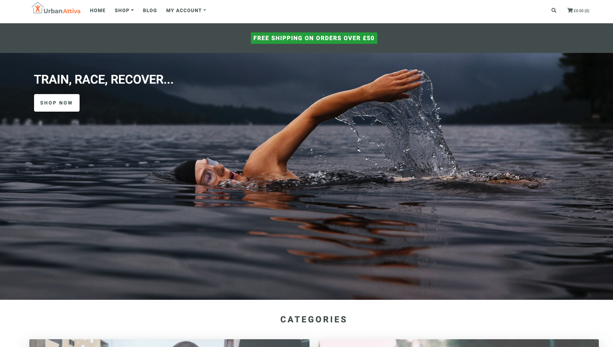

-   Section two of the home page images for each of the core product categories which when clicked link through to the product pages pre filtered by category.

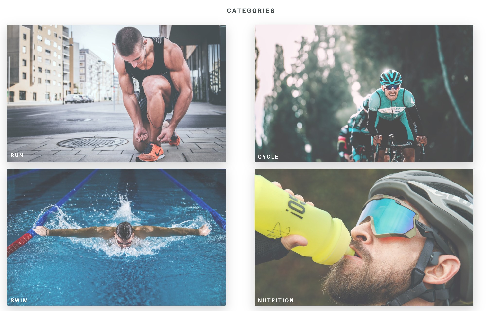

-   Section three of the home page includes some customer reviews.
-   Section four of the home page has some information highlighting free shipping thresholds, secure payments, and registered user discounts.

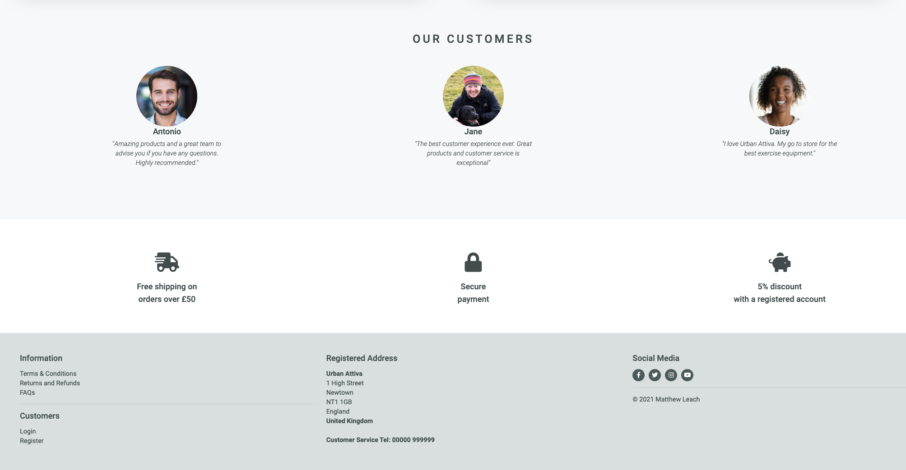

#### Register

-   A simple registration page for a user to register with Urban Attiva by entering and confirming their email address, choosing a user name, and entering their chosen password.
-   Once the user is registered they will be directed to the verify your email address page and will receive an email with a link to verify their email address.
-   When the email address has been verified the user will be directed to the log in page to log in.

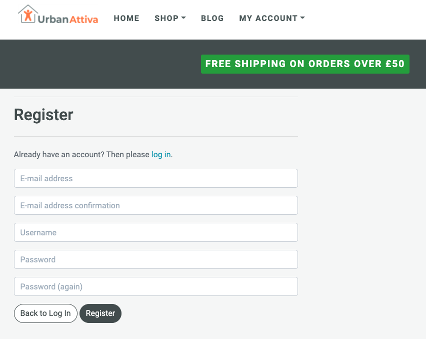

#### Log In

-   Simple log in page where the user can log in by entering their user name and password. Once logged in they will be directed to the home page.
-   A link to the registration page if the user has not yet registered.
-   A forgot password link to direct the user to the forgot password page where they can enter their email address to reset their password.

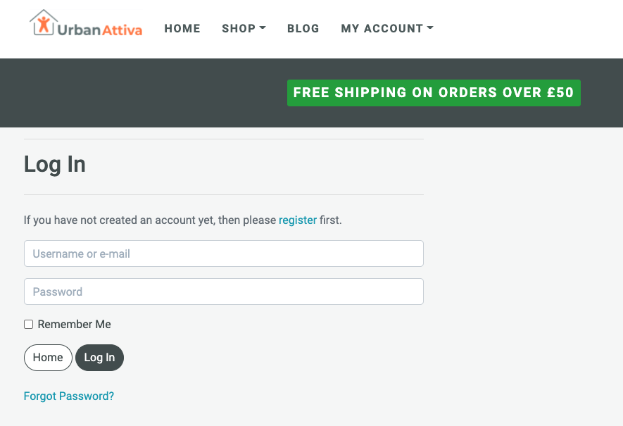

#### Profile Page

-   Contains a form where the user can enter their default shipping information. This information will be populated from an order if they have placed an order and have not input their shipping information. The shipping information can be updated on this page.
-   The customer's order history is displayed on the right of the page with a truncated order number link to allow the user view previously placed order details.

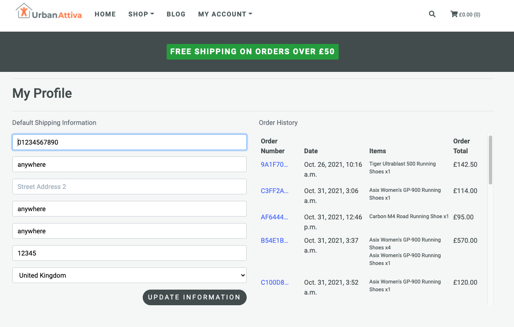

#### Shop

-   The shop navigation menu enables users to link to the product page with products displayed and filtered by core product categories and sub-categories.
-   The product page provides the shopper with the ability to sort the product listing by price, rating, name, or category.

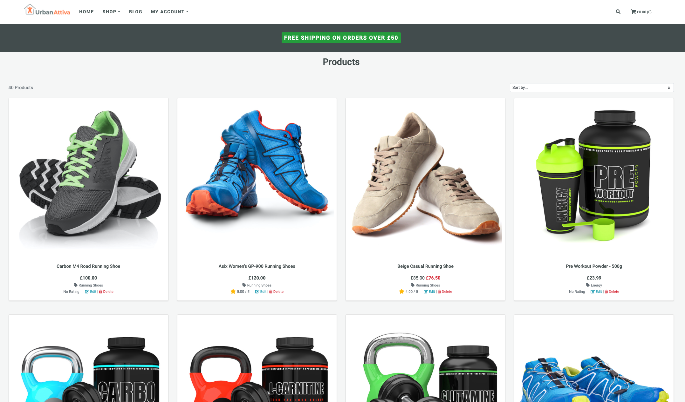

-   Clicking on a product images navigates the user to the product details page where information about the product is displayed.

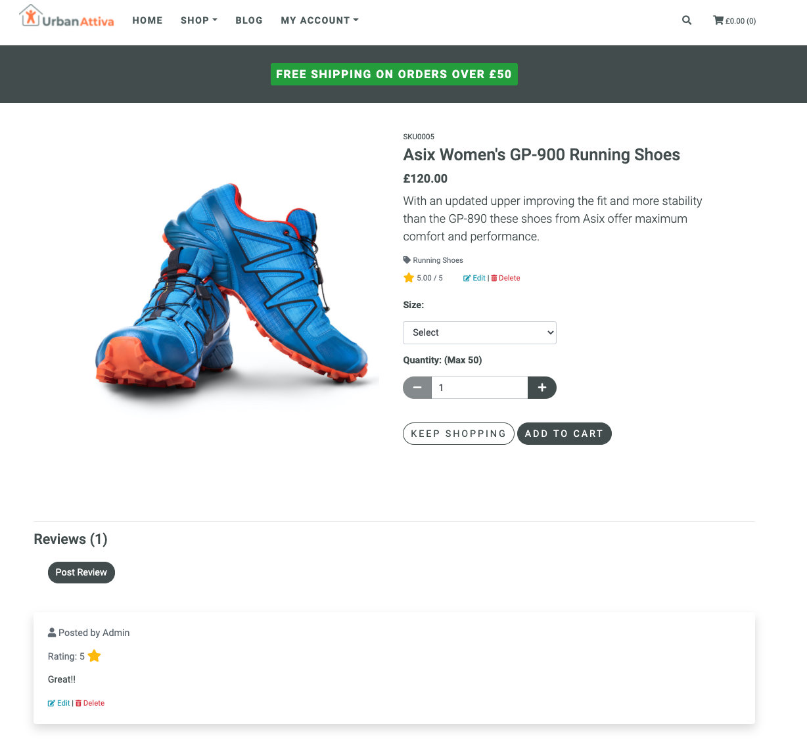

-   The user can add a product to their shopping cart from the product detail page and select the quantity and chosen size.

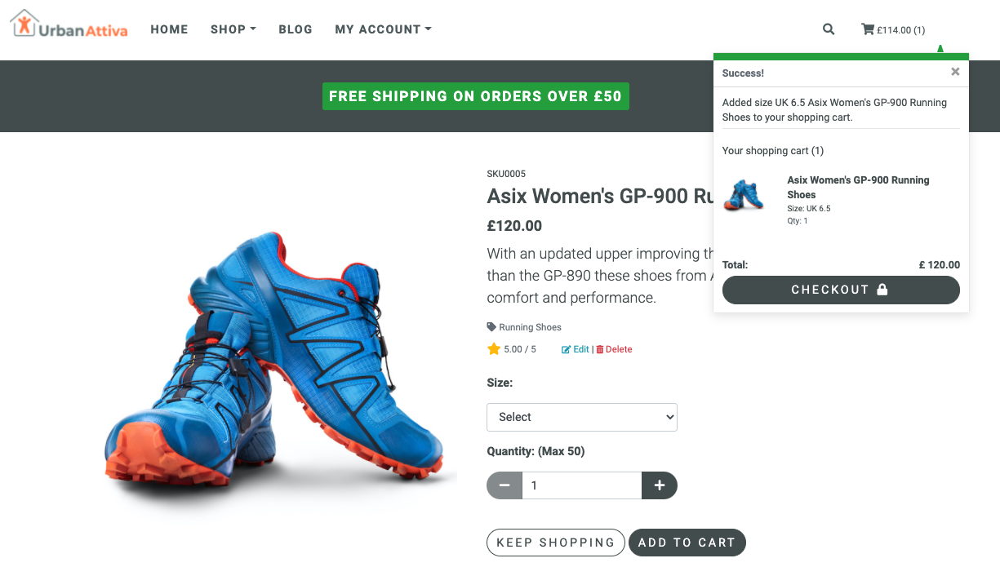

-   Registered users can leave product reviews which are displayed below the product details.
-   Admin users can edit or delete inappropriate product reviews via links in the product review when logged in.

#### Shopping Cart

-   Once the user has selected products and added them to their shopping cart a toast with a confirmation message and a summary of what is in their cart is displayed on the top right of the screen. The cart icon on the top right of the page will display an updated number of products and when clicked navigates the user to the cart page where details of the products are listed with the functionality to allow the cart items to be updated or deleted from the cart.
-   Registered users are eligible for an additional discount which is subtracted from their order total and displayed in the shopping cart summary.
-   On selecting the secure checkout button the customer is navigated to the checkout page.

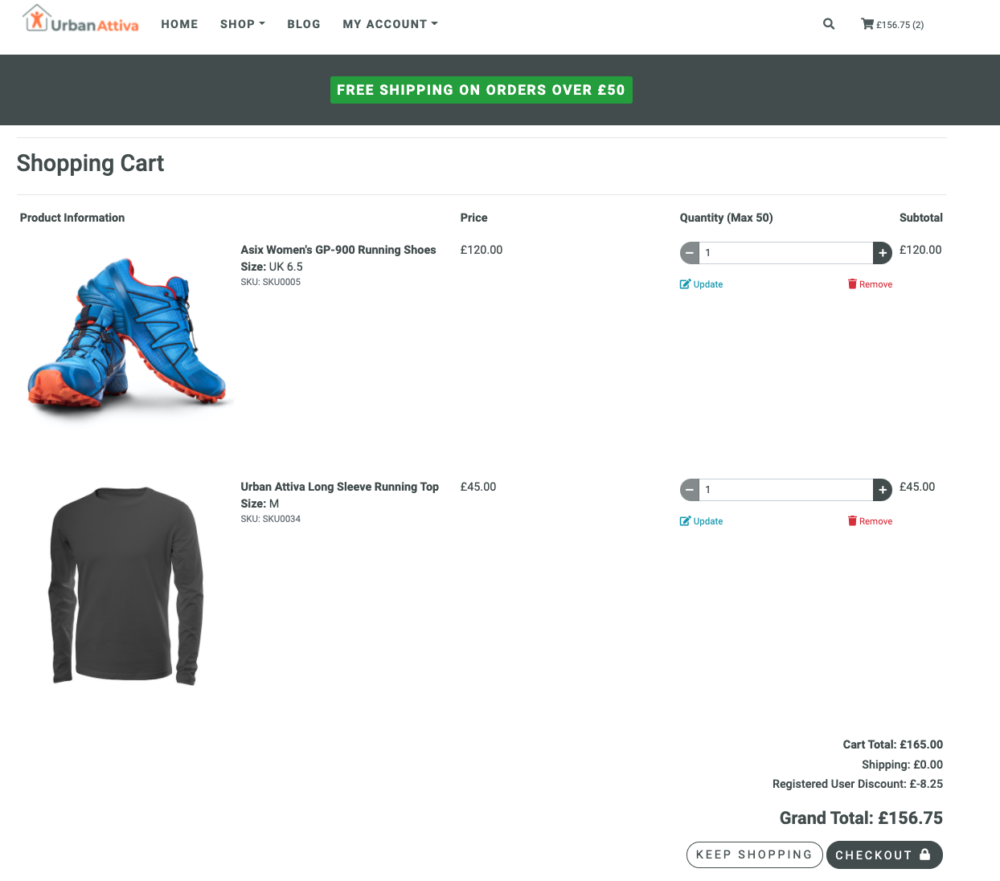

#### Checkout

-   The checkout page provides a form for the user to enter their details and credit card information with an order summary detailing the products in the order.
-   When the user selects the complete order button the order is processed securely via a Stripe integration and the customer is directed to the checkout success page with details of the order they have just placed. An email confirmation is also sent to the user.

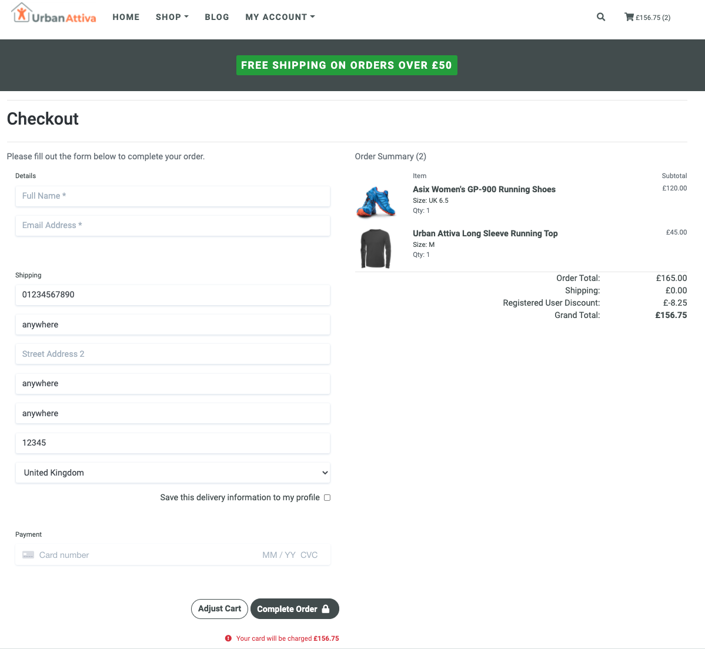

#### Blog

-   The blog page lists recent Urban Attiva blog articles with a brief introduction displayed. Users can search the blog page to display articles containing their search criteria.
-   Clicking on the read more button directs the user to the blog detail page where the full blog article is displayed.
-   Registered users can leave comments which are displayed below the blog article.

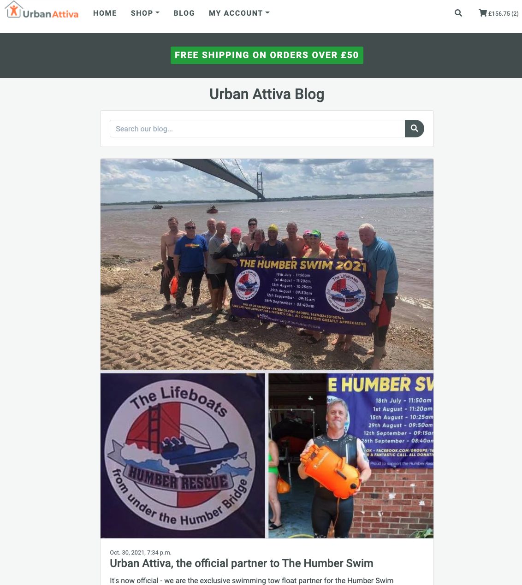

#### Product Management

-   Admin users have a product management menu option under their account menu when logged into the site. This allows the admin user to add new products to the site via the product management page.
-   Admin users can edit or delete existing products by selecting the relevant links that are displayed on the product cards and products detail pages when the user is logged in.

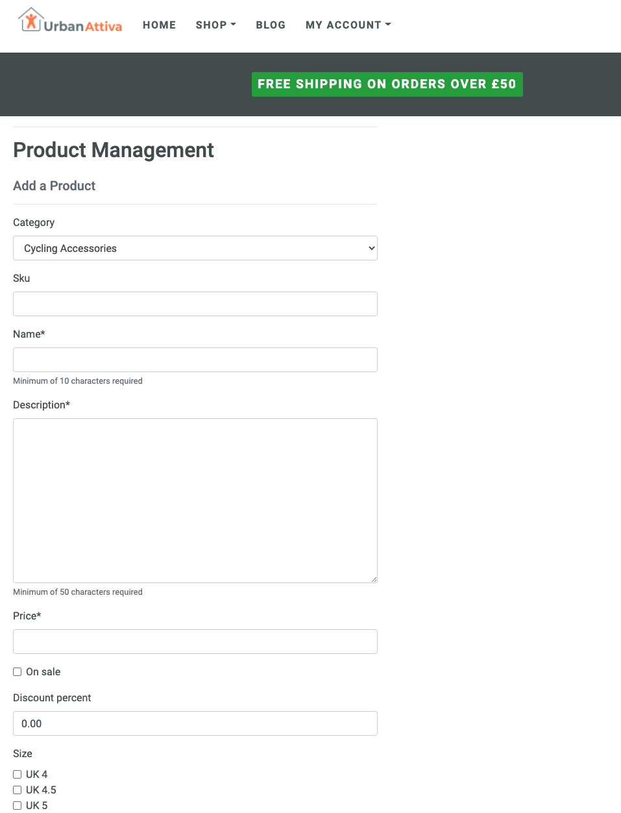

#### Blog Management

-   Admin users have a blog management menu option under their account menu when logged into the site. This allows the admin user to add new blog posts to the site via the blog management page.
-   Admin users can edit or delete existing blog posts by selecting the relevant links that are displayed on the blog detail page when the user is logged in.

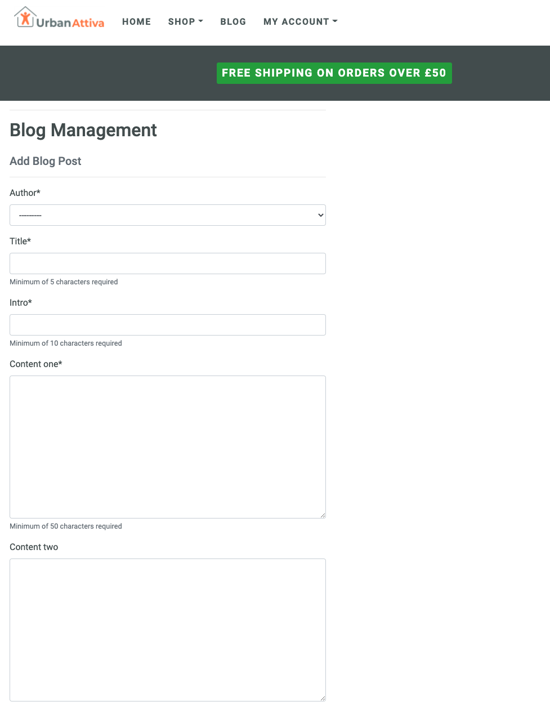

#### Footer Section - all pages

-   This section has information links for terms and conditions, returns policy, FAQs, cookies, log in and register, the registered company address, social media links and copyright wording.

_Note: Some of the social media links currently link to the social media websites and not Urban Attiva specific pages_

#### Future features

-   Allow only registered users who have purchased a particular product to leave a review.
-   Addition of multiple product images for each product. Time constraints and sourcing free images prevented me from sourcing multiple images for all the products.
-   Sharing of blog articles.
-   Social media sign on.

---

## Technologies Used

The following technologies have been used to in the development of the Urban Attiva website.

### Languages

-   [HTML5](https://en.wikipedia.org/wiki/HTML5) - used for the structure and content of the Urban Attiva website.
-   [CSS3](https://en.wikipedia.org/wiki/CSS) - used to style the Urban Attiva website.
-   [jQuery](https://jquery.com)- used for the development of interactive aspects across the website.
-   [Python](https://www.python.org) - used for the backend development. A full list of the Python modules used can be found in the requiremments.txt file.

### Frameworks - Libraries - Other

-   [Django](https://www.djangoproject.com) - web framework used to develop a secure, scalable, and maintainable website for Urban Attiva
-   [Bootstrap](https://getbootstrap.com) - utilised for the front-end design framework.
-   [SQLite3](https://www.sqlite.org) - used as the development database for the project.
-   [PostgresSQL](https://www.postgresql.org) - used for the production database.
-   [GitHub](https://github.com) - for hosting the website repository.
-   [GitPod](https://gitpod.io) - used as the development environment for the website.
-   [Google Fonts](https://fonts.google.com/) - used to source the font used throughout the website.
-   [Font Awesome](https://fontawesome.com/) - used to source icons for use throughout website.
-   [Balsamiq](https://balsamiq.com/) - utilised for the development of the website wireframes.
-   [Amazon Web Services S3](https://aws.amazon.com) - used to host the live static and media files.
-   [Favicon.io](https://favicon.io) - used to create the favicon.

### Testing Tools Used

-   [Google Chrome DevTools](https://developers.google.com/web/tools/chrome-devtools) - used to edit changes prior to implementing the code changes, to diagnose problems and for performance, accessibility, best practice, and search engine optimisation testing.
-   [Autoprefixer](https://autoprefixer.github.io/) - Autoprefixer is used to parse the CSS and to add vendor prefixes to CSS rules. 
-   [Markup validation service](https://validator.w3.org/) - for the validation of HTML5 code.
-   [CSS validation service](https://jigsaw.w3.org/css-validator/) - for the validation of the CSS3 code.
-   [JShint](https://jshint.com/) - used to check for errors in the JavaScript code. 
-   [PEP8](http://pep8online.com/) - used to check for errors in the Python code.

---

## Testing

Full details of testing are contained in the [testing document](TESTING.md).

---

## Deployment

### Deployment on Heroku

1.  Log in to [Heroku.com](https://id.heroku.com/) or create an account.
2.  On your personal dashboard click the 'New' button on the top-right of the screen.
3.  Enter your app name using hyphens instead of spaces or underscores.
4.  Select the region closest to you and click 'Create app'.
5.  Provision a new Postgres database.

-   Navigate to the 'Resources' tab
-   Search for Postgres in 'Add-ons'
-   Choose the plan type and click 'Provision'

6.  Using pip3 install dj_database_url and psycopg2-binary via your IDE CLI

-   pip3 install dj_database_url
-   pip3 install psycopg2-binary
-   freeze your requirements

7.  Navigate to your settings.py file and import dj_database_url. Comment out the default DATABASES configuration and replace the default database with a call to dj_database_url.parse and provide the Heroku database URL, which can be found in your Heroku app config variables in the settings tab.

8. Run migrations to the Heroku Postgres database.

-   python3 manage.py migrate

9.  If you used fixtures to load your product data these can now be loaded to the Postgres database.

-   python3 manage.py loaddata 'name of relevant fixtures file' - repeat for each file and ensure they are loaded in the correct order based on dependencies.

Alternatively you can download your data from your local mysql database:

-   Ensure your manage.py file is connected to your mysql database
-   Backup your current database and load it into a db.json file using the following command:

        python3 manage.py dumpdata --exclude auth.permission --exclude contenttypes > db.json

-   Connect your manage.py file to your postgres database
-   Load your data from the db.json file into postgres using the following command:

        python3 manage.py loaddata db.json          

10. Create a super user for the deployed version.

-   python3 manage.py createsuperuser

11. Remove the Heroku database configuration from your settings.py file and uncomment the original so that your Postgres database URL is not in your version control.
12. Add an if statement to connect to the Postgress database if DATABASE_URL is in os.environ else connect to local database.
13. Install gunicorn and freeze to your requirments file.
14. Create the Procfile and add the following to the file:

-   web: gunicorn `your-app-name`.wsgi:application

15. Log in to Heroku via the CLI:

-   heroku login -i and enter your Heroku credentials

16. Disable Heroku from collecting static files:

-   heroku config:set DISABLE_COLLECTSTATIC=1 --app `app-name`

or enter key DISABLE_COLLECTSTATIC and value 1 in your Heroku app settings config vars

17. Add the host name to your settings.py file:

-   ALLOWED_HOSTS = ['`app-name`.herokuapp.com', 'localhost']

18. Navigate to the Deploy tab.

19. Add, commit, and push your changes in your CLI and to deploy to Heroku:

-   git push heroku main

20. Connect your GitHub repository - select the Deploy tab and for deployment method select 'Connect to GitHub'. Connect your GitHub repository.
22. Enable automatic deploys.
23. Generate a new django secret key and enter this in your app settings config vars.
24. Go to settings.py and change the SECRET_KEY to be sourced from os.evniron.get('SECRET_KEY', '')
25. Set DEBUG = 'DEVELOPMENT' in os.environ
26. Add, commit, and push your changes.
27. Your app can now be opened via the Heroku dashboard by clicking the 'Open app' button. The app is now deployed without static files.

### Amazon Web Services S3 Bucket

1.  Create Amazon Web Services account if you don't already have an account.
2.  Navigate to AWS Management Console search for S3 and create a new bucket ensuring you uncheck 'Block all public access'.
3.  Under Properties turn on static website hosting - selecting 'Use this bucket to host a website' and enter index.html and error.html in the respective document fields.
4.  On the permissions tab under CORS configuration enter:
```
        [
        {
            "AllowedHeaders": [
                "Authorization"
            ],
            "AllowedMethods": [
                "GET"
            ],
            "AllowedOrigins": [
                "*"
            ],
            "ExposeHeaders": []
        }
        ]
```
5. Navigate to bucket policy and select policy generator to create a security policy for the bucket.

-   Select Type of Policy - S3 bucket policy
-   For Principle enter *
-   For Action select get object
-   Copy the ARN from the bucket policy tab and paste into the Amazon Resource Name field
-   Click Generate Policy and copy the policy into the Bucket policy editor
-   To enable access to all resources in the bucket add /* to the end of the resource key after your app name
-   Click save

6. Navigate to the Access Control List tab and select the List objects permission for everyone in the Public access section. Click save after confirming you understand the implication of providing access to everyone.


### Amazon Web Services Identity and Access Management (IAM)

1. Navigate to the AWS services menu and open IAM

-   Select User groups
-   Create a new group - manage-`app-name`
-   Click through the screens and click Create group

2. Select Policies

-   Click Create policy
-   Select the JSON tab
-   Select import managed policy
-   Search for S3 and import the S3 Full Access policy
-   Edit the JSON "Resource" and paste in the bucket ARN from the bucket policy tab accessed previously. Paste in twice as a list and /* after the second list item.
-   Select the next step and Review policy
-   Name the policy and add a description
-   Click Create policy

3. Navigate back to User groups and select the user group that you created earlier

-   Select the permissions tab and select Attach policy and search for the policy that has just been created
-   Select the policy and click Attach policy

4. Navigate to Users

-   Click Add user
-   Type the user name
-   Select Programmatic access for the Access type
-   Click next and add the user to the group that was created earlier
-   Click through and finally click Create user

5. Download the csv containing the access key and secret access key. Ensure this is saved securely as you will not be able to download this again.

### Connect django to AWS S3

1. Install boto3 and django-storages and freeze the requirements

-   pip3 install boto3
-   pip3 install django-storages
-   add storages to the installed apps in your settings.py file

2. Add the following settings to your settings.py file.
```
        if 'USE_AWS' in os.environ:
            # Bucket config
            AWS_STORAGE_BUCKET_NAME = `your-bucket-name`
            AWS_S3_REGION_NAME = `your S3 region name`
            AWS_ACCESS_KEY_ID = os.environ.get('AWS_ACCESS_KEY_ID')
            AWS_SECRET_ACCESS_KEY = os.environ.get('AWS_SECRET_ACCESS_KEY')
 ```       
3.  Go to Heroku and add AWS keys to the Heroku Config Vars in settings - from the csv file downloaded from AWS and add USE_AWS and set to True.
4.  Remove the 'DISABLE_COLLECT_STATIC' variable from the Config Vars
5.  Back in your settings.py file add the following to the Bucket config
```
        AWS_S3_CUSTOM_DOMAIN = f'{AWS_STORAGE_BUCKET_NAME}.s3.amazonaws.com'
```
5.  Create a custom_storages.py file in your main app folder and add the following.
```
        from django.conf import settings
        from storages.backends.s3boto3 import S3Boto3Storage


        class StaticStorage(S3Boto3Storage):
        location = settings.STATICFILES_LOCATION


        class MediaStorage(S3Boto3Storage):
        location = settings.MEDIAFILES_LOCATION
```
6.  In settings.py add the following under the Bucket config above.
```
        # Static and media files
        STATICFILES_STORAGE = 'custom_storages.StaticStorage'
        STATICFILES_LOCATION = 'static'
        DEFAULT_FILE_STORAGE = 'custom_storages.MediaStorage'
        MEDIAFILES_LOCATION = 'media'

        # Override static and media URLs in production
        STATIC_URL = f'https://{AWS_S3_CUSTOM_DOMAIN}/{STATICFILES_LOCATION}/'
        MEDIA_URL = f'https://{AWS_S3_CUSTOM_DOMAIN}/{MEDIAFILES_LOCATION}/'
```
7.  Add, commit, and push the changes which will trigger an automatic deployment to Heroku and you should see that the static files have been collected. Go to your AWS account and find the S3 bucket and there will be a static folder containing the static files.
8.  In your settings.py file add the following above your Bucket config settings.
```
        #  Cache control
        AWS_S3_OBJECT_PARAMETERS = {
            'Expires': 'Thu, 31 Dec 2099 20:00:00 GMT',
            'CacheControl': 'max-age=94608000',
        }
```
The full AWS settings should now be as follows.
```
        if 'USE_AWS' in os.environ:
            #  Cache control
            AWS_S3_OBJECT_PARAMETERS = {
                'Expires': 'Thu, 31 Dec 2099 20:00:00 GMT',
                'CacheControl': 'max-age=94608000',
            }
            # Bucket config
            AWS_STORAGE_BUCKET_NAME = 'urban-attiva'
            AWS_S3_REGION_NAME = 'eu-west-2'
            AWS_ACCESS_KEY_ID = os.environ.get('AWS_ACCESS_KEY_ID')
            AWS_SECRET_ACCESS_KEY = os.environ.get('AWS_SECRET_ACCESS_KEY')
            AWS_S3_CUSTOM_DOMAIN = f'{AWS_STORAGE_BUCKET_NAME}.s3.amazonaws.com'

            # Static and media files
            STATICFILES_STORAGE = 'custom_storages.StaticStorage'
            STATICFILES_LOCATION = 'static'
            DEFAULT_FILE_STORAGE = 'custom_storages.MediaStorage'
            MEDIAFILES_LOCATION = 'media'

            # Override static and media URLs in production
            STATIC_URL = f'https://{AWS_S3_CUSTOM_DOMAIN}/{STATICFILES_LOCATION}/'
            MEDIA_URL = f'https://{AWS_S3_CUSTOM_DOMAIN}/{MEDIAFILES_LOCATION}/'
```
9.  Add, commit, and push these final changes.

### Add Media files to S3

1.  Go to S3 and create a new folder called Media. Upload your media files.
2.  Click next and under Mange public permissions select Grant public read access to these object(s).
3.  Click through and click Upload.

### Confirm Email Address for Superuser

1.  Log in to django admin and navigate to Email addresses
2.  Locate the email address and mark as Verified and Primary

### Add Stripe Keys to Heroku Config Vars

1.  Go to Heroku settings and input the following keys and their related values (from Stripe developers are on your Stripe account).

-   STRIPE_PUBLIC_KEY
-   STRIPE_SECRET_KEY

2.  Create a new Stripe webhook endpoint in webhooks in Stripe developer menu - click add endpoint and add the heroku app URL followed by checkout/WH and select the relevant payment events and add endpoint.
3.  Get the webhook signing secret for Stripe dashboard and go to Heroku settings and input the following key and the webhook signing secret.

-   STRIPE_WH_SECRET

4.  Send a test webhook from Stripe to ensure the webhook listener is working.

### Cloning This Repository on GitPod

1. Select the repository in Gtthub
2. Click on the code dropdown button
3. Copy the https link to your clipboard
4. Open your gitpod workspace
5. In the CLI type "git clone" and paste the copied link - press enter
7. Install the required packages - pip3 install -r requirements.txt - press enter
8. In the Gitpod settings for the workspace enter:

    'DEVELOPMENT', 'True'
    'SECRET_KEY', 'your secret key'
    'STRIPE_PUBLIC_KEY', 'your stripe public key'
    'STRIPE_SECRET_KEY', 'your stripe secret key'
    'STRIPE_WH_SECRET', 'your stripe webhook secret'

9. Migrate the database models

    python3 manage.py makemigrations
    python3 manage.py migrate

10. Create a super user and verify the email address

    python3 manage.py createsuperuser

11. Run the app by typing python3 manage.py runserver and press enter.

---

## Credits

### Content

All text content included in this project is my own.

### Media

All images are my own, have been licensed from Adobe Stock, or are freely available on Unsplash. Credits are listed below.

**Home Page Images**

The home page images below are the only images that have not been licensed from Adobe Stock or are not my own images.

-   The hero image is sourced from Unsplash and is by [Todd Quackenbush](https://unsplash.com/photos/E9PJO_vL3E8)
-   Running category image is sourced from Unsplash and is by [Alexander Redl](https://unsplash.com/photos/d3bYmnZ0ank)
-   Cycling category image is sourced from Unsplash and is by [Angel Santos](https://unsplash.com/photos/96rlfzZ6LwY)
-   Swimming category image is sourced from Unsplash and is by [Gentrit Sylejmani](https://unsplash.com/photos/JjUyjE-oEbM)
-   Nutrition category image is sourced from Unsplash and is by [Munbaik Cycling Clothing](https://unsplash.com/photos/QPrPGq8yAyo)

**Product Images**

-   All product images are licensed from Adobe Stock.

**Blog Images**

-   All images are my own.
  

### Acknowledgements

-   [Precious Ijege](https://www.linkedin.com/in/precious-ijege-908a00168/?originalSubdomain=ng) for mentor guidance and support.

-   Igor from the Student Support team for assisting patiently with an issue following deployment to Heroku.