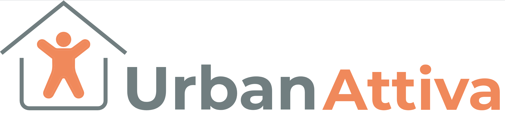
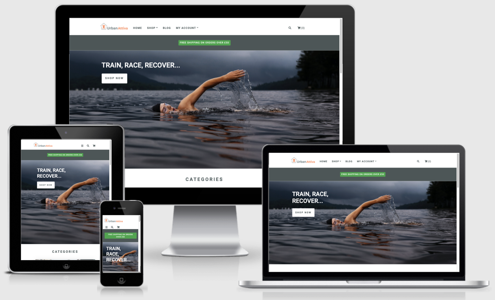

# Urban Attiva Website

This website has been developed as the first iteration of an eCommerce store for Urban Attiva, a sports equipment retailer. The website provides shoppers with the ability to browse and securely purchase products, add product reviews and to read the company blog to find out what is new with Urban Attiva and to leave comments on blog articles.

The site was developed using knowledge gained from the Code Institute HTML Essentials, CSS Essentials, User Centric Frontend Development, Interactive Frontend Development, Backend Development and Full STack Frameworks modules.

View the live website [here.](https://urban-attiva.herokuapp.com/)

---

## Contents

1.  [User Experience Design](#user-experience-design)
2.  [Features](#features)
3.  [Technologies Used](#technologies-used)
4.  [Testing](#testing)
5.  [Deployment](#deployment)
6.  [Credits](#credits)

---

## User Experience Design

### Strategy

The key business goals for developing the website are:

-   To sell both own brand and established brand sports products to generate revenue for the company.
-   To promote the Urban Attiva brand through the website, blog and social media to establish brand recognition, reputation and loyalty.

The key user goals for the website are:

-   To find and purchase quality products that will help me with my training and competition in my chosen sport.
-   To be kept informed of news and information in relation to the Urban Attiva company.

### Scope

#### User Stories

The requirements for the Urban Attiva website are captured as user stories.

#### Website Owner

-   As the website owner, I want branding to be clear and consistent across the website so that the user has a consistent experience.
-   As the website owner, I want the website to be search engine optimised so that users can easily find our website.
-   As the website owner, I want the website to be accessible to all users so that all users can use our website.
-   As the website owner, I want the website to be conformant to web development best practices so that I know the development quality meets required standards.
-   As the website owner, I want the  website to be compatible with different browsers so that users have a consistent experience no matter which browser they use.
-   As the website owner, I want the website to be secure so that only authorised users can access store management functionality.

#### Users

-   As a shopper, I want to understand what the store sells and to be able to navigate the website easily so that I can so that I can decide if I want to purchase any products.
-   As a shopper, I want to be able to access the website on all types of device so that I can use the device that is most convenient to me at the time.
-   As a shopper, I want to search products by name or description so that I can find specific products that I'd like to purchase.
-   As a shopper, I want to see products matching that I have searched for and the number of results returned so that I can see whether the product I searched for is available.
-   As a shopper, I want to view and sort multiple categories of products simultaneously so that I can find the products by price, name, rating or category across parent categories e.g. 'nutrition' or 'cycling'.
-   As a shopper, I want to view and sort specific categories of product so that I can find products by specific category e.g. 'running shoes' and sort by price, name or rating.
-   As a shopper, I want to view and sort the full list of available products so that I can find products by price, name, rating or category from the full list of products.
-   As a shopper, I want to view individual product details so that I can see the price, description, product rating, product image and available sizes of products.
-   As a shopper, I want to be able to select the quantity and size of product so that I can purchase the product quantity I want and in the correct size.
-   As a shopper, I want to view products that have been added to my shopping bag so that I can see the items I have selected and the total cost of the items in my shopping cart.
-   As a shopper, I want to adjust the quantity of items in my shopping bag so that I can make changes to the contents of my shopping cart before checkout.
-   As a shopper, I want to purchase an item without registering so that I can quickly purchase items without the need to register.
-   As a shopper, I want to enter my payment information so that I can quickly check out and pay for my items.
-   As a shopper, I want to view an order confirmation after checkout so that I can verify that I haven't made any mistakes when entering my information.
-   As a shopper, I want to receive an order confirmation after checkout so that I can keep a proof of purchase.
-   As a shopper, I want to read item reviews from verified shoppers so that I can see how other shoppers rate the products.
-   As a shopper, I want to see updates in relation to the company or interesting material so that I can find out more about the company, related topics or events.
-   As a shopper, I want to search blog posts so that I can find blog posts of interest to me.
-   As a shopper, I want to register for an account so that I can have a personal account and be able to view my profile.

#### Registered Users

-   As a registered user, I want to receive a confirmation email after registering so that I can verify that my account was successfully registered.
-   As a registered user, I want to have a personal user profile so that I can view my account information, order history and order confirmations.
-   As a registered user, I want to log in and log out once I have registered so that I can access my personal account information.
-   As a registered user, I want to add a product review so that I can provide a review of the product that I have purchased.
-   As a registered user, I want to recover my password if I have forgotten it so that I can reaccess my account.
-   As a registered user, I want to leave comments on blog posts so that I can express my views on the blog content.

#### Administrator

-   As an administrator, I want to add a blog post so that I can publish blog posts for users to read.
-   As an administrator, I want to add a product so that I can add new items to the store.
-   As an administrator, I want to delete a product so that I can remove items that are no longer sold.
-   As an administrator, I want to delete reviews so that I can remove inappropriate reviews.
-   As an administrator, I want to edit / update a blog post so that I can amend the content of blog posts.
-   As an administrator, I want to edit / update a product so that I can change product prices, descriptions, images and other product attributes.

### Structure

The Urban Attiva website has been designed to provide be intuitive and easy to navigate. The site has been developed to enable visitors to register, log in, search for products to add to their shopping cart, to check out securely, and to access their account information.

The website has the following key elements:

-   A simple landing page design with a main navigation menu with links for the home page, shop, blog and user account. 
-   The home page has a hero image with header and a prominant shop now button, images with links to the product categories, and a footer with links to further information and social media. A dropdown search field allows users to search for  products by entering their own search criteria.
-   The shop dropdown menu provides access to the main product categories and the product pages enable sorting within categories with a link through to individual product details.
-   Shopping cart and checkout functionality.
-   A blog page listing recent blog posts.
-   An account dropdown menu with links to register and log in. Once logged in a user has access to their profile and administration users can access the product and blog management functionality.

#### Information Architecture

Data Model:

The Urban Attiva database has seven tables as detailed in the attached data model.

### Skeleton

#### Wireframes

The wireframes were developed using [Balsamiq](https://balsamiq.com/).

-   Small device [wireframes](design/velo-route-small-device.png).
-   Medium device [wireframes](design/velo-route-medium-device.png).
-   Large device [wireframes](design/velo-route-large-device.png).

The following changes were made after the initial design.

-   Functionality to enable users to leave product reviews.
-   User registered discount functionality.

### Surface

The Urban Attiva website features a clean and simple design with #4B5657 used for dark backgrounds and text and #F6F7F7 for light backgrounds and text to provide good contrast. The footer section is #DEE3E3 and is on the same monochromtic scale as #4B5657 as used for the dark text and dark backgrounds. The product and blog listing cards are #FFFFFF so that they pop from the page against the #F6F7F7 background. The product detail page utilises a white background to match the image background.

#### Branding

A simple Urban Attiva logo has been developed aligned to the branding for an existing sister company.

#### Colours

Full details of the Urban Attiva colour template can be found in the [Urban Attiva Branding Guidelines](readme-files/urban-attiva-branding-guidelines.pdf)

UPDATE!!!!

A simple colour palette using #263238 for navigation and footer backgrounds and #FAFAFA for text to provide a good contrast whilst avoiding the potential eyestrain of using pure black and white.

All icons with the exception of the social media icons use colour #607D8B. Social media icons in footer are the same colour as the footer text #FAFAFA.

Colours have been used as accents for toast messages and these conform to the standard Bootstrap colours for each specific message type. 

BUTTONS!!!!!! UPDATE #4DD0E1 has been used for the flash messages background, #EF6C00 for the call to action button on the home page, #0097A7 for action buttons throughout the site and #D50000 for all delete buttons.

#### Typography

Roboto font has been utilised for all text across the website and detailed in the [Urban Attiva Branding Guidelines](readme-files/urban-attiva-branding-guidelines.pdf). This is a simple and modern font available from the Google Fonts library which is unobtrusive and easy to read. Font Awesome icons have been utilised for icons throughout the site.

#### Images

Images are used to add some additional colour to the website home page and for the product cards and blog posts.

### Defensive Design

The website has been developed incorporating the following defensive design aspects.

#### Error Handling

-   Toast have been utilised to provide users with messages clearly stating that an error has occurred
-   Error pages for 403, 404 and 500 errors which will be displayed to the user if any of these errors occur.

#### Confirm on Delete

-   All areas of the website where users can delete data incorporate modals to prompt the user if they really want to permanently delete the data.

#### User Authentication and Priveleges

-   Non-registered (anonymous) users can browse the website, purchase products, read the blog and see customer reviews and blog comments.
-   Registered users can view and update their account profile and view their order history as well as being able to add product reviews and blog comments.
-   Administrators (super users) can access and utilise the product management and blog management functionality and delete inappropriate customer reviews or blog comments. 

#### Data Input Validation

Django-allauth is utilised for all authentication, registration and account management functionality. This functionality incorporates data validation on these forms.

Data validation is on custom forms is incorporated on all data input fields with the following validation applied to:

Product management form:

-   Username validated to ensure that it is of length 5 - 15 characters and consists only of numbers and letters. The username is also checked to ensure it does not already exist in the database and a user is notified via a flash message if this is the case.
-   First name and last name fields cannot begin with a space, with a required length between 2 - 20 and letters.
-   Email address field is validated to ensure a valid email address in the correct format is entered.
-   Password is validated to ensure it is between 8 - 15 characters and contains at least one number and one capital and one lowercase letter.

Blog management form:

-   Category, difficulty and country are dropdown fields with data populated from the database.
-   Route name is validated to ensure it cannot start with a blank space and must consist only of letters with no special characters.
-   The route image is validated to ensure it is a valid URL and has a recognised jpg, jpeg, gif or png extension.
-   The route description is validated to ensure that it is of length between 10 - 300 characters consisting of letters, numbers and standard punctuation.
-   The route distance is validated to ensure it is a number between 1 and 6 numbers in length, so a maximum of 99999.
-   The route link is validated to ensure it is a valid URL.
-   The same validation is in place when a user comes to edit a route.

Product review form:

-   The category is populated form the database.
-   The cycling tip name is validated for a maximum of 30 characters which must be letters and spaces.
-   The cycling tip image is validated to ensure it is a valid URL and has a recognised jpg, jpeg, gif or png extension.
-   The cycling tip description is validated to ensure that it is of length between 10 - 300 characters consisting of letters, numbers and standard punctuation.
-   The cycling tip link is validated to ensure it is a valid URL.

Blog comment form:

-   The category input is validated to ensure the user only inputs letter, spaces and no special characters.

---

## Features

### Existing Features

#### Home Page

-   Urban Attiva logo with a link to the home page.
-   A navigation menu that allows the user to navigate the website by clicking the navigation links. The navigation menu collapses to a burger icon with aa exapnding sidenav menu on smaller devices. 
-   Section one of the home page includes a hero image, header text and a shop now button.
-   Section two of the home page images for each of the core product categories which when clicked link through to the product pages pre filtered by category.
-   Section three of the home page includes some customer reviews.
-   Section four of the home page cconatins some information highlighting free shipping thresholds, secure payments and registered user discounts.

#### Register

#### Profile Page

#### Log In

#### Shop

-   The shop navigation menu enables users to link to the product page with products displayed filtered by core product categories and sub categories.
-   The product page provides the shopper with the ability to sort the product listing by price, rating, name or category.
-   Clicking on a product images navigates the user to the product details page where information about the product is displayed. The user can add a product to their shopping cart from the product detail page and select the quentity and chosen size.

#### Shopping Cart

-   Once the user has selected products and added them to their shopping cart a toast with a confirmation message and a summary of what is in their cart is displayed on the top right of the screen. The cart icon on the top right of the page will display an updated number of products and when clicks navigates the user to the cart page where details of the products are listed with the functionality to allow the cart items to be updated or deleted from the cart.
-   On selecting the secure checkout button the customer is navigated to the checkout page.

#### Checkout

-   .......

#### Join Us Page

-   The Join Us page has a simple form for the user to provide their details so that the user can be registered. All inputs are validated.
-   Upon registration the user's details are stored in a MongoDB database with the password hashed for additional security.

#### Profile Page

-   The profile page displays the logged in user's profile details and the routes they have added which are displayed with the most recently added routes listed first.
-   The displayed routes can be edited by selecting the edit button or they can be deleted. There is a cancel button if the user decides that they do not wish to edit the route which returns the user to their profile page. The delete button is linked to a modal that displays a message to ask if the use definitely wants to delete the route.

#### Add Routes Page

-   The Add Routes page allows users who are logged in to the site to add new routes.
-   There is a simple input form that has dropdown select options for choosing a route category, country and difficulty level and input fields for users to add a route name, route image, route description, route distance and a link to the route on the users favourite GPS activity platform, e.g. Strava.

#### Add Cycling Tip Page

-   The Add Cycling Tips page allows admin users to add new cycling tips to the VeloRoute website.
-   There is a simple input form that has a dropdown select option for choosing a cycling tip category and input fields for the admin user to add a cycling tip name, an image, a cycling tip description and a link to further information related to the cycling tip.

#### Manage Categories Page

-   The Manage Categories page allows administration users to add, edit and delete the categories used for the dropdown select options on the Add Route and Add Cycling Tips pages.
-   The categories are displayed as simple cards categorised by each category type with buttons for adding, editing and deleting the categories.

#### Footer Section

-   This section has information links for terms and conditions, returns policy, FAQs, cookies, log in and register, the registerd company address, social media links and copyright wording.

_Note: The social media links currently link to the social media websites and not VeloRoute specific pages_

#### Future features

-   Allow only registered users who have purchased a particular product to leave a review.
-   Addition of multiple product images for each product. Time constraints and sourcing free images prevented me from sourcing multiple images for all the products.
-   Sharing of blog articles.
-   Social media sign on.

---

## Technologies Used

The following technologies have been used to in the development of the Urban Attiva website.

### Languages

-   [HTML5](https://en.wikipedia.org/wiki/HTML5) - used for the structure and content of the Urban Attiva website.
-   [CSS3](https://en.wikipedia.org/wiki/CSS) - used to style the Urban Attiva website.
-   [jQuery](https://jquery.com)- used for the development of interactive aspects across the website.
-   [Python](https://www.python.org) - used for the backend development. A full list of the Python modules used can be found in the requiremments.txt file.

### Frameworks - Libraries - Other

-   [Django](https://www.djangoproject.com) - web framework used to develop a secure, scalable and maintainable website for Urban Attiva
-   [Bootstrap](https://getbootstrap.com) - utilised for the front-end design framework.
-   [SQLite3](https://www.sqlite.org) - used as the development database for the project.
-   [PostgresSQL](https://www.postgresql.org) - used for the production database.
-   [GitHub](https://github.com) - for hosting the website repository.
-   [GitPod](https://gitpod.io) - used as the development environment for the website.
-   [Google Fonts](https://fonts.google.com/) - used to source the font used throughout the website.
-   [Font Awesome](https://fontawesome.com/) - used to source icons for use throughout website.
-   [Balsamiq](https://balsamiq.com/) - utilised for the development of the website wireframes.
-   [Amazon Web Sevices S3](https://aws.amazon.com) - used to host the live static and media files.
-   [Coolors](https://coolors.co/) - used for creating the colour palette image.

### Testing Tools Used

-   [Google Chrome DevTools](https://developers.google.com/web/tools/chrome-devtools) - used to edit changes prior to implementing the code changes, to diagnose problems and for performance, accessibility, best practice and search engine optimisation testing.
-   [Autoprefixer](https://autoprefixer.github.io/) - Autoprefixer is used to parse the CSS and to add vendor prefixes to CSS rules. 
-   [Markup validation service](https://validator.w3.org/) - for the validation of HTML5 code.
-   [CSS validation service](https://jigsaw.w3.org/css-validator/) - for the validation of the CSS3 code.
-   [JShint](https://jshint.com/) - used to check for errors in the JavaScript code. 
-   [PEP8](http://pep8online.com/) - used to check for errors in the Python code.

---

## Testing

Full details of testing are contained in the [testing document](TESTING.md).

---

## Deployment

Github has been used for hosting the website repository and Gitpod as the IDE. 

A Code Institute template was used for the initial creation of this repository which can be found [here](https://github.com/Code-Institute-Org/gitpod-full-template).
To use this template to create a similar project simply click 'Use Template' at the top of the repository. You will be directed to name your own
repositry using this template. Once named, you can decide whether to make the 'repo' public or private, my version is public. Then select 'Create Repository'.
The 'repo' should then open and you can begin working on it by selecting the green GitPod button on the top right of the repo. The GitPod button will open your workspace.

### Deployment via Heroku

1. Go to [Heroku.com](https://id.heroku.com/login) and login or create and account.
2. Your dashboard should open and there will be a 'New' button on the top-right of the screen, select this.
3. Select 'Create New App' from the buttons drop down menu
4. Add your app name (it must be unique, lowercase with a dash used instead of spaces)
5. Select the region closest to you and click create app
6. Install 'dj_database_url' and 'psycopg2' via the CLI using the pip3 install prefixed to the module names
>* pip3 install dj_database_url
>* pip3 install psycopg2
7. Login to Heroku via the CLI 
>* 'heoku login -i'
8. Run migration on the Heroku Postgres -
>* 'heroku run python manage.py migrate'
9. Create a new super user for this deployed version 
10. Install 'gunicorn' and then freeze to your requirments.txt
11. Create the 'Procfile' note the capital 'P' and add :

>* web: gunicorn `your-app-name`.wsgi:application

12. Disable Heroku from collecting static files - 
>* 'heroku config:set DISABLE_COLLECTSTATIC=1 --app `your-app-name`
13. Add the host name to your settings.py file, under ALLOWED_HOSTS
>* ALLOWED_HOSTS = ['`you-app-name`.herokuapp.com', 'localhost']
14. To set the environment variables open the settings tab and select 'Reveal Config Vars'
15. Add the following variable keys and the values you have chosen :
    - AWS_ACCESS_KEY_ID
    - AWS_SECRET_ACCESS_KEY
    - DATABASE_URL
    - DISABLE_COLLECT_STATIC = 1
    - EMAIL_HOST_PASS
    - EMAIL_HOST_USER
    - SECRET_KEY
    - STRIPE_PRICE_ID
    - STRIPE_PUBLIC_KEY
    - STRIPE_SECRET_KEY
    - STRIPE_WH_SECRET
    - USE_AWS = True

16. Hide Con Fig Vars and reopen the deploy tab
17. Add and commit your changes in the CLI, then use the below to to deploy to Heroku :
>* git push Heroku main
18. You will then need to connect your GitHub Repository, in the deploy tab, under method, select "Connect to GitHub". Connect your GitHub account, ensure the correct profile name is displayed. Then add your repository name, search and select the correct repository.
19. Under automatic deployment, enable automatic deployment.
20. You can now deploy via the heroku dashboard by clicking the `open app` button. At this stage your site has deployed with out any static files.

### Amazon Web Services S3 Bucket 
1. Create your AWS account
2. Search for S3 and create a new bucket, select 'allow public access'
3. Under Properties go to static website hosting. Select enable typle index.html as index.html and save.
4. In Permissions, under CORS use :
>* [
  {
      "AllowedHeaders": [
          "Authorization"
      ],
      "AllowedMethods": [
          "GET"
      ],
      "AllowedOrigins": [
          "*"
      ],
      "ExposeHeaders": []
  }
]
5. Still in permissions, select bucket policy:
>* Generate bucket policy and copy the bucket ARN
>* Choose S3 Bucket Policy as type of policy
>* For Principle enter *
>* Paste ARN copied from above
>* Add Statement
>* Generate Policy
>* Copy Policy JSON Document
>* Paste policy into Edit Bucket policy on the previous tab
>* Save 
6. Under Access Control List (ACL):
>* For Everyone (public access), tick List
>* Accept that everyone in the world may access the Bucket
>* Save

### AWS IAM
1. From the IAM dashboard within AWS, select User Groups:
>* Create a new group
>* Click through and create group
2. Select Policies:
>* Create policy
>* Under JSON tab, click Import managed policy
>* Choose AmazongS3FullAccess
>* Edit the resource to include the Bucket ARN noted earlier when creating the Bucket Policy
>* Click next step and go to Review policy
>* Give the policy a name and description of your choice
>* Create policy
3. Go back to User Groups and choose the group created earlier
>* Under Permissions > Add permissions, choose Attach Policies and select the one just created
>* Add permissions
4. Under Users::
>* Choose a user name
>* Selecet programmatic access as the access type
>* Click through next
>* Add the user to the group just created
>* Click next and creat user
5. Download the ``.csv` containing the access key and secret access key.
>* The `.csv` file is onlu available once and cannot be downloaded again

### Connecting Heroku to AWS S3
1. Install boto3 and django-storages and freeze your requirements
2. Add the values from the `.csv` you downloaded to the Heroku configvars
3. Delete 'DISABLE_COLLECT_STATIC = 1' from the config vars
4. Create a custom storage python file in your development environment with the following

>* from django.conf import settings
>* from storages.backends.s3boto3 import S3Boto3Storage

>* class StaticStorage(S3Boto3Storage):
    location = settings.STATICFILES_LOCATION

>* class MediaStorage(S3Boto3Storage):
    location = settings.MEDIAFILES_LOCATION

5. Deploy the app
6. In the S3 bucket, set up a new media folder at the same level as the tatic folder and upload any required files. Both files need to be publicly accessible.

### Make a clone on GitPod

1. Select the Repo you wish to clone in GitHub
2. Click on the code dropdown button
3. Copy the https link to your clipboard
4. Open your gitpod workspace
5. In the terminal type "git clone" and paste the copied link
6. Hit enter to create the clone
7. To install the required packages type pip install -r requirements.txt into the command line
8. Set up an env.py and add the env.py to your gitignore file. Include:
>* import os
>* os.environ.setdefault("STRIPE_SECRET_KEY", "`ADD YOUR KEY`")
>* os.environ.setdefault("STRIPE_PUBLIC_KEY", "`ADD YOUR KEY`")
>* os.environ.setdefault("STRIPE_WH_SECRET", "`ADD YOUR KEY`")
9. add the following to your settings.py 
>* if os.path.exists("env.py"): import env
10. Apply migrations
11. Create your super user
12. To view what the code will look like in a browser from here type "python3 manage.py runserver" into the console and hit enter or replace "manage.py" with which ever you have named the app
13. A pop-up will appear stating "A service is available on Port 8080" select Open Browser

---

## Challenges

Two significant challenges were encountered late on in the project:

1.  

2.  

---

## Credits

### Content

All text content included in this project is my own.

### Media

All images are my own, have been licensed from Adobe Stock or are freely available on Unsplash. Credits are listed below.

**Home Page Images**

-   The hero image is sourced from Unsplash and is by [Todd Quackenbush](https://unsplash.com/@toddquackenbush?utm_source=unsplash&utm_medium=referral&utm_content=creditCopyText) [on] (<a href=")https://unsplash.com/s/photos/swimmer?utm_source=unsplash&utm_medium=referral&utm_content=creditCopyText)

- Running category image
- Cycling category image
- Swimming category image
- Nutrition category image
- Customer review 1 image
- Customer review 2 image
- Customer review 3 image

**Product Images**

-   All product images are licensed from Adobe Stock.

**Blog Images**

-   All images are my own.
  

### Acknowledgements

-   [Precious Ijege](https://www.linkedin.com/in/precious-ijege-908a00168/?originalSubdomain=ng) for mentor guidance and support.

-   Igor from the Student Support team for assisting patiently with an issue following deployment to Heroku.