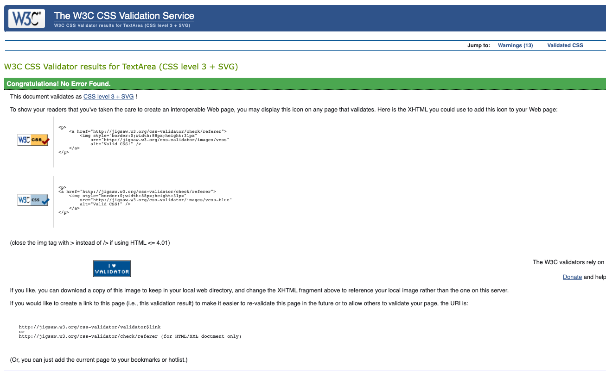
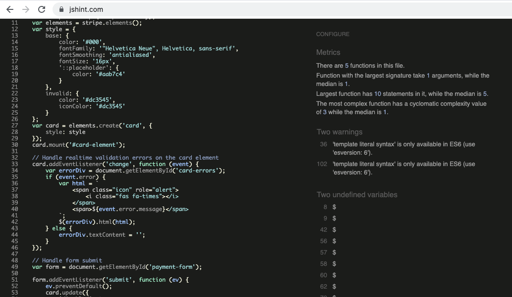

# Urban Attiva eCommerce Website Testing

---

## Contents 

1.  [Code Validation](#code-validation)
2.  [Browser Compatibility](#browser-compatibility)
3.  [Responsiveness](#responsiveness)
4.  [Lighthouse Reports](#lighthouse-reports)
5.  [User Story Testing](#user-story-testing)
6.  [Defensive Design Testing](#defensive-design-testing)
7.  [Defects and Issues](#defects-and-issues)

---

### CSS Code Validation

The HTML code was validated using the [W3C CSS validation service](https://jigsaw.w3.org/css-validator/).

### HTML Code Validation

The HTML code was validated using the [W3C Markup validation service](https://validator.w3.org/). The validation was completed inputting the relevant page URLs into the w3 validator.

-   Minor issues on base HTML - H5 heading used in a list - corrected, and minor error where ul as a child element of ul - left as is not considered significant.
-   The products page has repeated duplicate ID errors and warnings for deleteProductLabel and multiple aria-labelledby errors (must point to element in the same document) - this is due to multiple products and link to modal for deletion - left as not a significant issue.

### jQuery Code Validation

The jQuery code was validated using the [JSHint validation service](https://jshint.com/).

A couple of minor warnings but no errors found.

### Python Code Validation

The Python code was validated using the [PEP 8 Online Validation Service](http://pep8online.com/).

Only minor errors were found and all were resolved.

---

## Browser Compatibility

Browser compatibility was good across Safari, Opera, Edge, Firefox, and Chrome browsers.

[Browser compatibility](testing-files/urban-attiva-browser-compatibility.pdf)

---

## Responsiveness

Responsiveness was good across all device sizes. Responsiveness of the site has been tested with [Chrome DevTools](https://developers.google.com/web/tools/chrome-devtools) and [Responsive Design Checker](https://www.responsivedesignchecker.com/).

The site has been tested on the following devices on Responsive Design Checker although full responsiveness testing could not be carried out using this site due to csrf token issues preventing access to certain pages.

-   Desktop: 1600x900, 1920x1200.
-   Notebook: 1366x768 
-   Mobile and Tablet: Galaxy S5/S6/S7, iPhone 5/SE, iPhone 6/7/8, iPhone 6/7/8 plus, iPhone x, iPad, iPad Pro, Kindle Fire and Nexus 9

In addition to the above the app has also been tested on actual iPhone X, iPhone SE, 11" MacBook Air, 13" MacBook Pro, iPad touch, and iPad Pro devices.

[Responsiveness testing](testing-files/urban-attiva-responsiveness-testing.pdf)

--- 

## Lighthouse Reports

Lighthouse reports were run for all pages of the website. A significant improvement was seen following code validation and user story testing that resulted in issues being addressed such as a lack of a meta tag, improving text contrast in the footer, and missing alt attributes. 

--- 

## User Story Testing

The user stories below have all been tested through two test cycles. The full test results for all user stories are detailed in the attached [testing report](testing-files/urban-attiva-user-story-testing.pdf).

#### Website Owner

-   As the website owner, I want to ensure the branding is clear and consistent across the website so that the user has a consistent experience.
-   As the website owner, I want to ensure the website is search engine optimised so that users can easily find our website.
-   As the website owner, I want to ensure the website is accessible to all users so that all users can use our website.
-   As the website owner, I want to ensure the website is conformant to web development best practices so that I know the development quality meets required standards.
-   As the website owner, I want to ensure the website is compatible with different browsers so that users have a consistent experience no matter which browser they use.
-   As the website owner, I want to ensure the website is secure so that only authorised users can access store management functionality.

#### Shoppers

-   As a shopper, I want to understand what the store sells and to be able to navigate the website easily so that I can so that I can decide if I want to purchase any products.
-   As a shopper, I want to be able to access the website on all types of device so that I can use the device that is most convenient to me at the time.
-   As a shopper, I want to search products by name or description so that I can find specific products that I'd like to purchase.
-   As a shopper, I want to see products matching what I have searched for and the number of results returned so that I can see whether the product I searched for is available.
-   As a shopper, I want to view and sort multiple categories of products simultaneously so that I can find the products by price, name, rating, or category across parent categories e.g. 'nutrition' or 'cycling'.
-   As a shopper, I want to view and sort specific categories of product so that I can find products by specific category e.g. 'running shoes' and sort by price, name, or rating.
-   As a shopper, I want to view and sort the full list of available products so that I can find products by price, name, rating, or category from the full list of products.
-   As a shopper, I want to view individual product details so that I can see the price, description, product rating, product image and available sizes of products.
-   As a shopper, I want to be able to select the quantity and size of product so that I can purchase the product quantity I want and in the correct size.
-   As a shopper, I want to view products that have been added to my shopping bag so that I can see the items I have selected and the total cost of the items in my shopping cart.
-   As a shopper, I want to adjust the quantity of items in my shopping bag so that I can make changes to the contents of my shopping cart before checkout.
-   As a shopper, I want to purchase an item without registering so that I can quickly purchase items without the need to register.
-   As a shopper, I want to enter my payment information so that I can quickly check out and pay for my items.
-   As a shopper, I want to view an order confirmation after checkout so that I can verify that I haven't made any mistakes when entering my information.
-   As a shopper, I want to receive an order confirmation after checkout so that I can keep a proof of purchase.
-   As a shopper, I want to read item reviews from registered shoppers so that I can see how other shoppers rate the products.
-   As a shopper, I want to see updates in relation to the company or interesting material so that I can find out more about the company, related topics, or events.
-   As a shopper, I want to search blog posts so that I can find blog posts of interest to me.
-   As a shopper, I want to register for an account so that I can have a personal account and be able to view my profile.

#### Registered Users

-   As a registered user, I want to receive a confirmation email after registering so that I can verify that my account was successfully registered.
-   As a registered user, I want to have a personal user profile so that I can view my account information, order history and order confirmations.
-   As a registered user, I want to log in and log out once I have registered so that I can access my personal account information.
-   As a registered user, I want to add a product review so that I can provide a review of the product that I have purchased.
-   As a registered user, I want to recover my password if I have forgotten it so that I can gain access to my account.
-   As a registered user, I want to leave comments on blog posts so that I can express my views on the blog content.

#### Administrator

-   As an administrator, I want to add a blog post so that I can publish blog posts for users to read.
-   As an administrator, I want to add a product so that I can add new items to the store.
-   As an administrator, I want to delete a product so that I can remove items that are no longer sold.
-   As an administrator, I want to delete reviews so that I can remove inappropriate reviews.
-   As an administrator, I want to edit / update a blog post so that I can amend the content of blog posts.
-   As an administrator, I want to edit / update a product so that I can change product prices, descriptions, images, and other product attributes.
-   As an administrator, I want to delete blog posts so that I can remove old blog entries.
-   As an administrator, I want to delete blog post comments so that I can remove inappropriate comments.

---

## Defensive Design Testing

1. Tested in user story testing.
2. Validation has been included on all form fields and tested as listed below:

Product management form:

-   SKU - optional field restricted to 7 characters.
-   Name - users are prevented from adding just blank spaces and an error message toast informs the user that they should not enter just blank spaces in the product name or description fields. A regex pattern has been applied to the comments field to restrict the users to entering only text, numbers, and common punctuation characters.
-   Description - users are prevented from adding just blank spaces and an error message toast informs the user that they should not enter just blank spaces in the product name or description fields. A regex pattern has been applied to the comments field to restrict the users to entering only text, numbers, and common punctuation characters.
-   Price - required field with a maximum of 4 digits
-   Discount % - this field is required when the on_sale flag is selected. Users are prevented from submitting the product form until a discount percentage has been added and an error is displayed below the field stating the discount percentage must be added for a product that is on sale.
-   Image URL - django model URLField to ensure only a valid URL is added.

Blog management form:

-   Title - users are prevented from adding just blank spaces and an error message informs the user that valid text is required and the field must not be blank. A regex pattern has been applied to the comments field to restrict the users to entering only text, numbers, and common punctuation characters.
-   Intro - users are prevented from adding just blank spaces and an error message informs the user that valid text is required and the field must not be blank. A regex pattern has been applied to the comments field to restrict the users to entering only text, numbers, and common punctuation characters.
-   Content one - users are prevented from adding just blank spaces and an error message informs the user that valid text is required and the field must not be blank. A regex pattern has been applied to the comments field to restrict the users to entering only text, numbers, and common punctuation characters.
-   Content two - users are prevented from adding just blank spaces and an error message toast informs the user that they should not enter just blank spaces in the product name or description fields. A regex pattern has been applied to the comments field to restrict the users to entering only text, numbers, and common punctuation characters.
-   Content three - users are prevented from adding just blank spaces and an error message toast informs the user that they should not enter just blank spaces in the product name or description fields. A regex pattern has been applied to the comments field to restrict the users to entering only text, numbers, and common punctuation characters.
-   Image URL - django model URLField to ensure only a valid URL is added.

Product review form:

-   Rating - required field with dropdown select option
-   Review comment - users are prevented from adding just blank spaces and an error message toast informs the user that they should not enter just blank spaces in the review form. A regex pattern has been applied to the comments field to restrict the users to entering only text, numbers, and common punctuation characters.

Blog comment form:

-   Comment title - users are prevented from adding just blank spaces and an error message toast informs the user that they should not enter just blank spaces in the comment form. A regex pattern has been applied to the comments field to restrict the users to entering only text, numbers, and common punctuation characters.
-   Comment - users are prevented from adding just blank spaces and an error message toast informs the user that they should not enter just blank spaces in the comment form. A regex pattern has been applied to the comments field to restrict the users to entering only text, numbers, and common punctuation characters.

---

## Defects and Issues

### Resolved

1.  Defect Ref DEF001: It was discovered during testing that users could delete the quantity of a product form the quantity field prior to adding to the cart which resulted in a 500 error. Solved by adding 'or' 1 in the add to cart view quantity variable. This is not an ideal solution but the user can then adjust the quantity in their cart prior to submitting the order. Would need a more satisfactory solution if developed further.
2.  Defect Ref DEF002: It was noticed during testing that the validation was not working on the cart quantity field allowing the user to type negative, decimals or delete the quantity value resulting in a 500 error. Implemented a HTML5 constraint and added (Max 50) to the Quantity label  as with Defect Ref DEF001, this is not the most elegant solution but avoids 500 errors for the user.
3.  Defect Ref DEF003: Defect fixed to ensure 'No rating' is displayed when no ratings have been submitted by users.
4.  Defect Ref DEF004: Register and log in link wording changed to ensure consistency across the site.
5.  Defect Ref DEF005: Update wording and link text colours for log in and register links in product review and blog comments sections.
6.  Defect Ref DEF007: Modals for deleting product, product reviews, blog entries and blog comments were not appearing consistently centred on screen. Changed from absolute to fixed positioning and issue resolved.

### Unresolved

1.  Defect Ref DEF006: Sorting by rating is failing as products with no rating appear at the top when filter by rating high to low - needs to be resolved.
2.  Defect Ref DEF008: The add product review and blog comments buttons are not rendering correctly on Safari browser. Also affecting other buttons - looks like a CSS issue but only affects Safari.

---

[Link to README.md file](README.md).